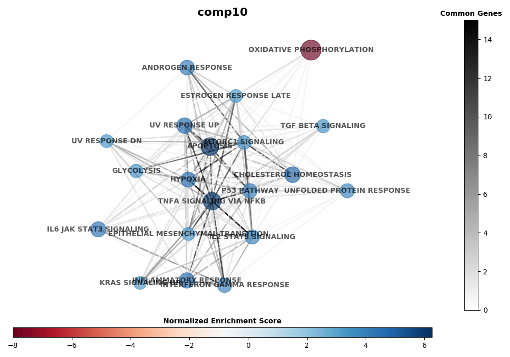

# gseapynet
Running GSEA with network view of pathways.

### Install Requirements ###

##### Tested with Python3 #####

```
python3 -m pip install -r requirements.txt
```

### Inputs ###

1. --csv - CSV file with DE genes with columns for *gene*, *fold-change (log FC, etc.)*, and *signficance (adjusted pvalue, pvalue, etc)*.
2. --sig - Signficance threshold (< 0.05)
3. --sig-col - Column in CSV with signficance (ex: pvalue)
4. --minfc - Minimum fold change ( > 0.25)
5. --minfc-col - Column with fold change value (ex: log2diff)
6. --fdr-pathway - Significance threshold for GSEA pathway (< 0.05)
7. --png - png (or svg) output file.
8. --gmt - pathway genesets, can use a local gmt file or the name of a library from enrichr (https://amp.pharm.mssm.edu/Enrichr/#stats)

### Example ###

```
python3 gseapynet.py --csv degs.csv --sig 0.001 --sig-col adj_pval --minfc 0.25 --minfc-col logFC --pathway-fdr 0.05 --png reactome_result.png --gmt Reactome_2016
```

### Results ###

1. Png with enriched pathways as nodes sized and colored by NES score.  Edges show common genes.



2. CSV file (named as "reactome_results.csv" in example call)


### Tweaks ###

To change the color map for the networks - edit "cmap = matplotlib.cm.coolwarm" to a valid maplotlib color map.


